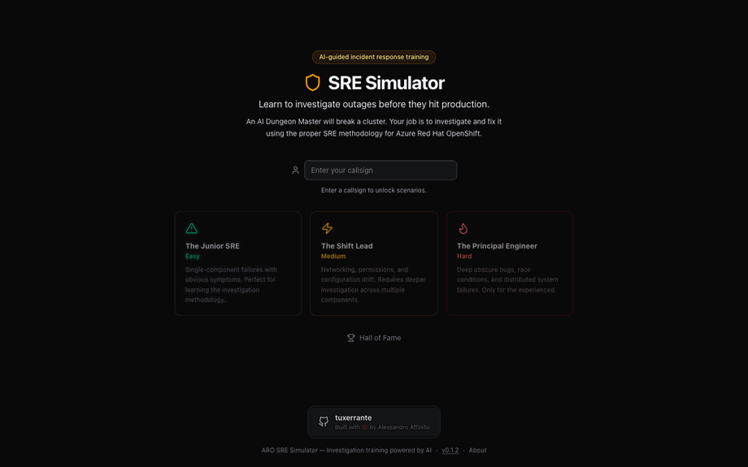

# SRE Simulator

## The Break-Fix Game for Azure Red Hat OpenShift


SRE Simulator is a training product that turns incident response into a
hands-on game. An AI Dungeon Master generates realistic ARO incidents, and
players investigate and resolve them using a structured SRE method.

<p align="center">
  
</p>

## Why teams use it

- Practice real-world ARO troubleshooting in a safe environment.
- Reinforce disciplined investigation phases instead of random command spam.
- Build confidence in incident handling across junior to principal levels.
- Measure decision quality with objective scoring, not only final outcome.

## Main product features

- AI-generated break-fix scenarios at three difficulty levels.
- Guided investigation workflow:
  Reading -> Context -> Facts -> Theory -> Action.
- Chat-driven command support with terminal-style execution feedback.
- Dashboard context panels for cluster signals and incident clues.
- Score tracking for efficiency, safety, documentation, and accuracy.
- Leaderboard to compare performance over time.

## How a session works

1. Choose a difficulty and get an incident ticket.
2. Investigate via chat, commands, and dashboard context.
3. Build and test hypotheses using observed evidence.
4. Apply the fix and complete the scenario.
5. Review score quality and improvement areas.

## Quick start

```bash
git clone https://github.com/tuxerrante/SRESimulator.git
cd SRESimulator
make install
make dev
```

Open `http://localhost:3000` in your browser.

## Documentation

- Product architecture: [docs/ARCHITECTURE.md](docs/ARCHITECTURE.md)
- Runtime internals: [docs/AI_RUNTIME.md](docs/AI_RUNTIME.md)
- Setup, operations, and deployment:
  [docs/OPERATIONS.md](docs/OPERATIONS.md)
- Release and versioning policy:
  [docs/RELEASES.md](docs/RELEASES.md)
- Infra post-apply checklist:
  [infra/POST_APPLY_CHECKLIST.md](infra/POST_APPLY_CHECKLIST.md)
- Original product design:
  [CLAUDE.md](CLAUDE.md)

## Roadmap

- Train and deploy a product-specific model profile for better SRE guidance
  quality and lower response latency.
