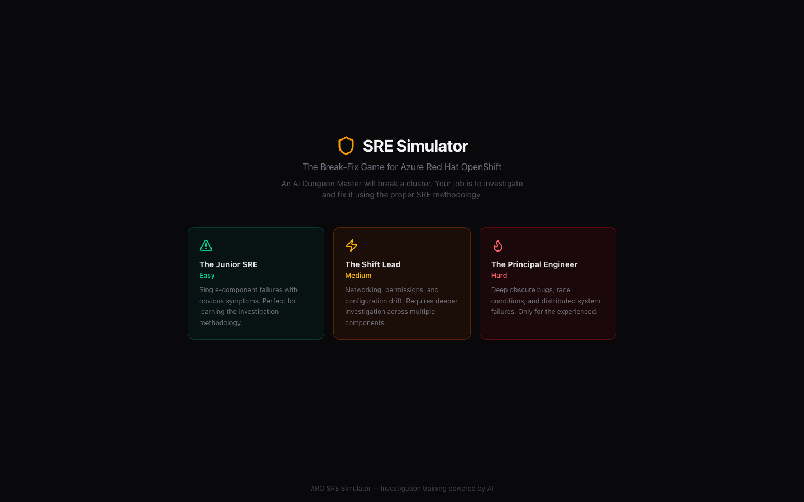
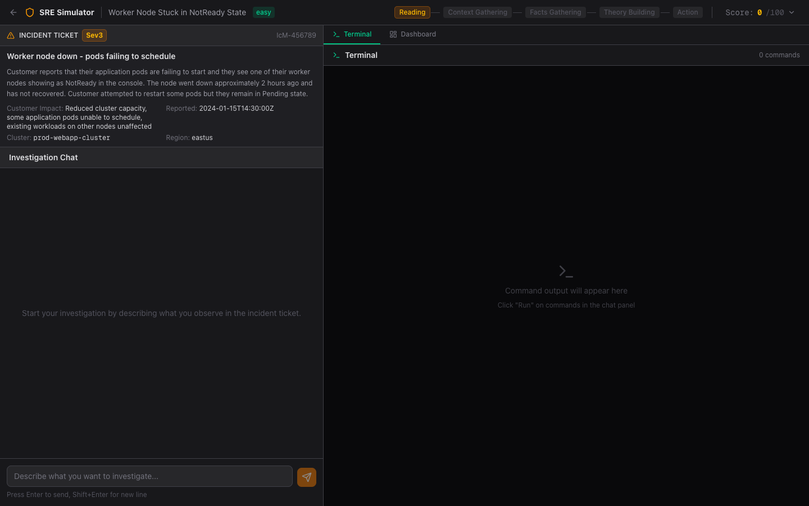
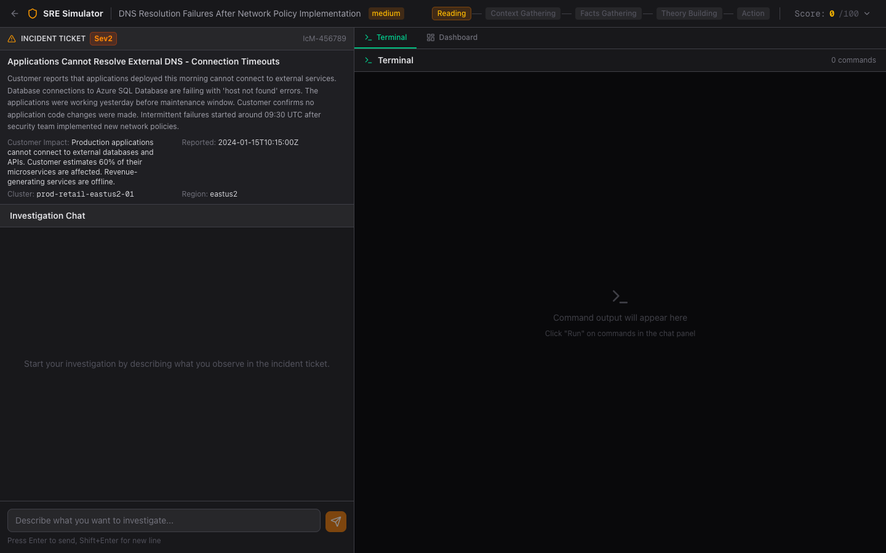
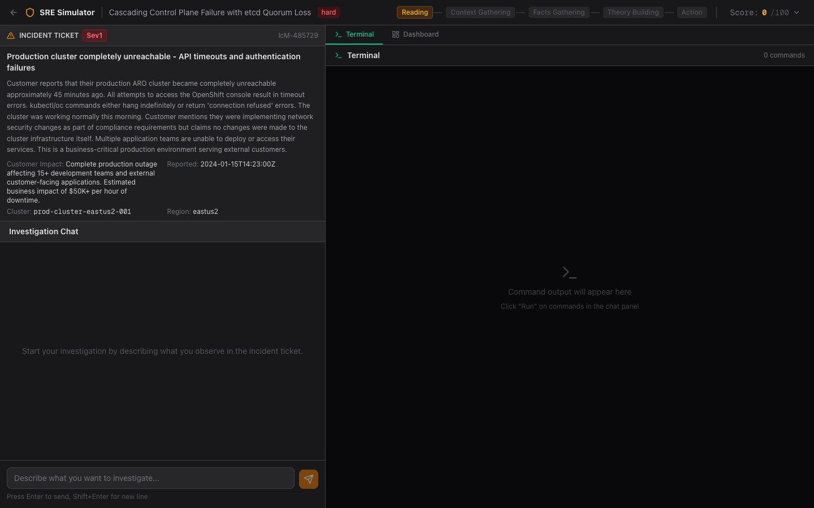

# 🎮 SRE Simulator

## _The Break-Fix Game for Azure Red Hat OpenShift_


> An AI-powered training tool that gamifies the SRE investigation experience.
> An AI **Dungeon Master** 🧙 generates realistic ARO cluster incidents, and you investigate them using the proper methodology:
>
> **📖 Reading → 🔍 Context Gathering → 📊 Facts Gathering → 💡 Theory Building → 🔧 Action**

You're scored on how well you follow the process, not just whether you find the fix!

<p align="center">
  
</p>

<table>
  <tr>
    <td align="center"><a href="img/scenario-easy.png"></a><br><b>Easy</b> — Worker Node NotReady</td>
    <td align="center"><a href="img/scenario-medium.png"></a><br><b>Medium</b> — DNS Resolution Failures</td>
    <td align="center"><a href="img/scenario-hard.png"></a><br><b>Hard</b> — Cascading Control Plane Failure</td>
  </tr>
</table>

---

## 🕹️ How It Works

1. 🎯 **Pick a difficulty** — Junior SRE (easy), Shift Lead (medium), or Principal Engineer (hard)
2. 📋 **Read the incident ticket** — the AI generates a realistic IcM ticket with cluster context
3. 💬 **Investigate via chat** — describe what you want to check; the Dungeon Master suggests `oc` commands, KQL queries, and Geneva checks
4. ▶️ **Run commands** — click "Run" on suggested commands to see simulated cluster output in the terminal panel
5. 📊 **Check the dashboard** — view cluster health, active alerts, and upgrade history
6. ✅ **Resolve the incident** — identify the root cause and apply the fix

Your score tracks four dimensions: **Efficiency**, **Safety**, **Documentation**, and **Accuracy** — starting from 0 and climbing with every smart move. See [Architecture & Game Design](docs/ARCHITECTURE.md) for full details.

---

## 📋 Prerequisites

| Requirement                    | Version                                |
| ------------------------------ | -------------------------------------- |
| 🟢 Node.js                     | >= 20                                  |
| 📦 npm                         | >= 10                                  |
| ☁️ Google Cloud SDK (`gcloud`) | Optional (only for Vertex provider)    |
| 🤖 Managed AI endpoint         | Vertex or Azure OpenAI/Foundry         |

---

## 🤖 AI Runtime Modes

The backend supports two runtime modes and multiple providers:

- **Mock mode** (`AI_MOCK_MODE=true`): no live model calls; useful for smoke tests and chart validation.
- **Live mode** (`AI_MOCK_MODE=false`): performs real model requests.
- **Providers** (`AI_PROVIDER`):
  - `vertex`
  - `azure-openai` (Azure OpenAI / Azure AI Foundry deployments)
- **Context management:** Chat history is automatically compacted when token estimates exceed the budget, preserving key investigation state (phase, facts, hypotheses, mentioned commands) while reducing prompt size. Per-route Azure OpenAI deployment overrides allow cost/performance optimization across routes. Token usage (prompt, completion, reasoning) is logged per route for both Azure OpenAI and Vertex providers.

Health and probe endpoints:

- `GET /readyz` — readiness (returns `503` if AI runtime config is invalid)
- `GET /api/ai/readiness` — detailed AI config checks (safe to expose, no secrets)
- `GET /api/ai/probe?live=true` — active live probe to the configured provider (for end-to-end validation)
- `GET /api/ai/token-metrics` — per-route token usage totals and recent history

See `docs/ARO_AI_CONNECTIVITY_SPIKE.md` for the full ARO pod connectivity validation workflow.

---

## 🔑 LLM Setup

### Option A — Vertex (Claude on Vertex AI)

```bash
gcloud auth login
gcloud auth application-default login
```

### Step 2 — Configure environment

```bash
cp frontend/.env.local.example frontend/.env.local
```

Edit `frontend/.env.local`:

```env
CLOUD_ML_REGION=us-east5
ANTHROPIC_VERTEX_PROJECT_ID=your-gcp-project-id
```

> 💡 The SDK authenticates via Application Default Credentials. No API keys needed.

### Step 3 — Verify access

```bash
source frontend/.env.local
gcloud config set project $ANTHROPIC_VERTEX_PROJECT_ID
curl -s -X POST \
  -H "Authorization: Bearer $(gcloud auth print-access-token)" \
  -H "Content-Type: application/json" \
  "https://${CLOUD_ML_REGION}-aiplatform.googleapis.com/v1/projects/${ANTHROPIC_VERTEX_PROJECT_ID}/locations/${CLOUD_ML_REGION}/publishers/anthropic/models/claude-sonnet-4@20250514:rawPredict" \
  -d '{"anthropic_version":"vertex-2023-10-16","messages":[{"role":"user","content":"hi"}],"max_tokens":10}'
```

A `200` response means you're ready. If not, ensure the Vertex AI API and Claude models are enabled in your GCP project.

### Option B — Azure OpenAI / Foundry

For local backend runs, set env vars:

```env
AI_PROVIDER=azure-openai
AI_MOCK_MODE=false
AI_STRICT_STARTUP=true
AI_MODEL=gpt-5.2
AI_AZURE_OPENAI_ENDPOINT=https://<your-account>.cognitiveservices.azure.com
AI_AZURE_OPENAI_DEPLOYMENT=<deployment-name>
AI_AZURE_OPENAI_API_VERSION=2024-10-21
AI_AZURE_OPENAI_API_KEY=<api-key>
```

Verify:

```bash
curl -s "http://localhost:8080/api/ai/probe?live=true" | jq
```

For Kubernetes/Helm deployments, keep both endpoint and API key in a Secret:

```bash
oc -n <namespace> create secret generic azure-openai-creds \
  --from-literal=endpoint="https://<your-account>.cognitiveservices.azure.com" \
  --from-literal=api-key="<azure-openai-key>"
```

Then deploy with:

```bash
helm upgrade --install sre-simulator ./helm/sre-simulator \
  -n <namespace> \
  -f helm/sre-simulator/values-aro-ai-azure-foundry.example.yaml
```

---

## 🚀 Getting Started

```bash
git clone https://github.com/tuxerrante/SRESimulator.git
cd SRESimulator

# Configure environment (see LLM Setup above)
cp frontend/.env.local.example frontend/.env.local

# Install and run
make install
make dev
```

Open [http://localhost:3000](http://localhost:3000) in your browser.

### Make targets

| Command                     | Description                                         |
| --------------------------- | --------------------------------------------------- |
| `make install`              | Install all dependencies                            |
| `make dev`                  | Start Next.js dev server                            |
| `make build`                | Build the production bundle                         |
| `make lint`                 | Run all linters                                     |
| `make typecheck`            | Run TypeScript type checking                        |
| `make smoke-local-vertex`   | Run local live Vertex probe against backend         |
| `make smoke-backend-mssql`  | Start backend with MSSQL and smoke-test `/api/scores` |
| `make e2e-azure-route-up`   | Build/deploy temporary ARO route using Azure OpenAI |
| `make e2e-azure-route-down` | Tear down temporary Azure e2e namespace             |
| `make public-exposure-audit`| Verify frontend-only public exposure in OpenShift   |
| `make db-port-forward-check`| Verify backend DB path via local `oc port-forward`  |
| `make prod-up-final`        | Guarded final deploy (Geneva + exposure + DB checks) |
| `make tf-preflight`         | Run Azure preflight gates for final infra           |
| `make tf-init-isolated`     | Init Terraform with per-owner isolated state key    |
| `make security`             | Run security audit + lockfile check                 |
| `make all`                  | Full CI pipeline                                    |
| `make clean`                | Remove build artifacts                              |

For `make e2e-azure-route-up`, set these runtime variables first (either export them in your shell or place them in `backend/.env.local`):

```bash
export AZURE_SUBSCRIPTION_ID=<subscription-id>
export ARO_RG=<aro-resource-group>
export ARO_CLUSTER=<aro-cluster-name>
export AOAI_RG=<azure-openai-resource-group>
export AOAI_ACCOUNT=<azure-openai-account-name>
export AOAI_DEPLOYMENT=<azure-openai-deployment-name>
```

For the final environment (`aaffinit-test-*`), use:

```bash
make tf-preflight \
  OWNER_ALIAS=aaffinit \
  TF_STATE_ACCOUNT=<state-account> \
  LOCATION=westeurope \
  TF_STATE_KEY=aaffinit-test-sre-simulator.tfstate \
  SQL_SERVER_NAME=aaffinit-test-sql-20260403 \
  GENEVA_SUPPRESSION_ACCESS_CONFIRMED=true

make tf-init-isolated OWNER_ALIAS=aaffinit
```

If `TF_STATE_ACCOUNT` is missing or does not exist, `make tf-preflight` now
prompts to create the backend resources for first-time runs.
After preflight passes, backend defaults are saved to `infra/.tf-backend.env`
and reused automatically by `make tf-init-isolated`.

---

## 📚 Documentation

- **[Architecture & Game Design](docs/ARCHITECTURE.md)** — project structure, tech stack, scoring system, investigation methodology, API routes
- **[Infra Post-Apply Checklist](infra/POST_APPLY_CHECKLIST.md)** — Geneva suppression, production/e2e namespace flow, exposure + DB validation checks
- **[ARO AI Connectivity Spike](docs/ARO_AI_CONNECTIVITY_SPIKE.md)** — prove Claude-on-Vertex connectivity from a pod end-to-end
- **[CLAUDE.md](CLAUDE.md)** — original design document and game spec

---

## 🗺️ Roadmap

- [ ] Train and deploy a project-specific fine-tuned model on Azure OpenAI to improve response speed and domain correctness for SRE investigations.
