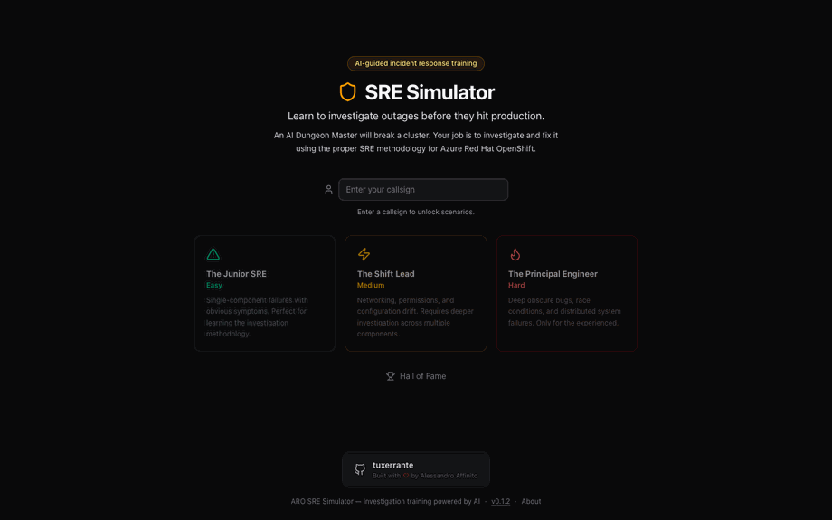

# SRE Simulator

## The Break-Fix Game for Azure Kubernetes Platforms


SRE Simulator is a training product that turns incident response into a
hands-on game. An AI Dungeon Master generates realistic Kubernetes and
OpenShift incidents, and players investigate and resolve them using a
structured SRE method.

<p align="center">
  
</p>

## Why teams use it

- Practice real-world Kubernetes and OpenShift troubleshooting in a safe
  environment.
- Reinforce disciplined investigation phases instead of random command spam.
- Build confidence in incident handling across junior to principal levels.
- Measure decision quality with objective scoring, not only final outcome.

## Main product features

- Platform-aware session paths for `aro-classic`, `aro-hcp`, and `aks`.
- AI-generated break-fix scenarios at three difficulty levels.
- Guided investigation workflow:
  Reading -> Context -> Facts -> Theory -> Action.
- Chat-driven command support with terminal-style execution feedback.
- Dashboard context panels for cluster signals and incident clues.
- Score tracking for efficiency, safety, documentation, and accuracy.
- Leaderboard to compare performance over time.

## How a session works

1. Choose a platform.
2. Choose a difficulty and get an incident ticket.
3. Investigate via chat, commands, and dashboard context.
4. Build and test hypotheses using observed evidence.
5. Apply the fix and review score quality and improvement areas.

## Quick start

```bash
git clone https://github.com/tuxerrante/SRESimulator.git
cd SRESimulator
python3 -m pip install --user pre-commit
# Install the Bun version pinned in .bun-version if it is not already available.
make install
make dev
```

Open `http://localhost:3000` in your browser.

`make install` uses Bun as the dependency installer and also installs commit and push hooks. Every push runs
`make quality-gate` (lint, type checks, unit tests, and backend integration
tests) before Git sends it to the remote.

## Support this project

If SRE Simulator has helped you learn, demo, or teach incident response, and
you would like to support my work on it, you can do that here:

- GitHub Sponsors: [@tuxerrante](https://github.com/sponsors/tuxerrante)
- Ko-fi: [alessandroaffinito](https://ko-fi.com/alessandroaffinito)
- Buy Me a Coffee: [tuxerrante](https://buymeacoffee.com/tuxerrante)
- Amazon wishlist: [gift cards and project gear](https://www.amazon.it/hz/wishlist/ls/7FXUYV40OB6H?ref_=wl_share)

## Maintenance

- Preview cleanup of generated artifacts in worktrees older than 14 days:
  `make cleanup-worktrees-dry-run`
- Remove cached modules, coverage, and build output from old worktrees:
  `make cleanup-worktrees`
- Install a weekly macOS `launchd` job (Sunday at 04:00 local time) that runs
  the same cleanup automatically:
  `make install-weekly-worktree-cleanup`
- Remove the weekly cleanup job:
  `make uninstall-weekly-worktree-cleanup`

## Deployment targets

Production-style semver deployments now target **AKS by default**. That path
uses GHCR images, Envoy Gateway on the existing static public IP, and the
custom hostname `https://play.sresimulator.osadev.cloud`. The frontend stays on
a cluster-internal `ClusterIP` service, while the backend remains private and
is reached only through the frontend's same-origin proxy. Azure SQL-backed
backend scaling still activates when `DB_SECRET_NAME` is provided.

The explicit AKS rollback path is still `publicService` mode, which promotes
only the frontend back to a public `LoadBalancer` service without changing the
rest of the deployment workflow. The previous **ARO** deployment flow remains
supported as a platform fallback; switch between platforms with
`CLUSTER_FLAVOR=aks|aro` locally or `PROD_CLUSTER_FLAVOR=aks|aro` in GitHub
Actions.

Most customer-managed Azure resources remain in the main resource group. The
only expected exception is the AKS-managed node resource group, which Azure
creates automatically.

Production Sentry rollout is wired through Helm values rather than image
rebuilds. `frontend.sentry.*` populates deployed `NEXT_PUBLIC_SENTRY_*`
container env. Browser Sentry initialization reads a runtime bootstrap script
from the same-origin telemetry route and initializes once that config is
available, keeping enablement runtime-driven without freezing config at build
time. `backend.sentry.*` continues to drive the server-side `SENTRY_*` env
directly. Keep both disabled until the production DSNs are available, and
leave the frontend replay sample rates at `0` for launch unless production
volume proves it is safe to raise them.

Browser source-map upload is separate from runtime enablement: the frontend
build uploads source maps only when `SENTRY_AUTH_TOKEN`, `SENTRY_ORG`, and
`SENTRY_PROJECT` are present at build time. If you set `SENTRY_RELEASE`, treat
it as a build-time release only: it must exactly match the uploaded artifact
release, otherwise omit it entirely. Builds still succeed without these
variables, but source-map upload stays disabled.

Use generic test events only as ingest smoke checks; verify actor/session/
request correlation with a request-driven chat or command failure through the
deployed same-origin proxy path.

## Documentation

- Default development workflow:
  [docs/DEVELOPMENT_WORKFLOW.md](docs/DEVELOPMENT_WORKFLOW.md)
- Product architecture: [docs/ARCHITECTURE.md](docs/ARCHITECTURE.md)
- Runtime internals: [docs/AI_RUNTIME.md](docs/AI_RUNTIME.md)
- Content boundary: [docs/CONTENT_BOUNDARY.md](docs/CONTENT_BOUNDARY.md)
- Setup, production operations, and post-apply checklist:
  [docs/OPERATIONS.md](docs/OPERATIONS.md)
- Infra post-apply checklist:
  [infra/POST_APPLY_CHECKLIST.md](infra/POST_APPLY_CHECKLIST.md)
- Release and versioning policy:
  [docs/RELEASES.md](docs/RELEASES.md)
- Helm chart profiles and platform-specific values:
  [helm/sre-simulator/README.md](helm/sre-simulator/README.md)
- Original product design:
  [CLAUDE.md](CLAUDE.md)

## Roadmap

- Train and deploy a product-specific model profile for better SRE guidance
  quality and lower response latency.
